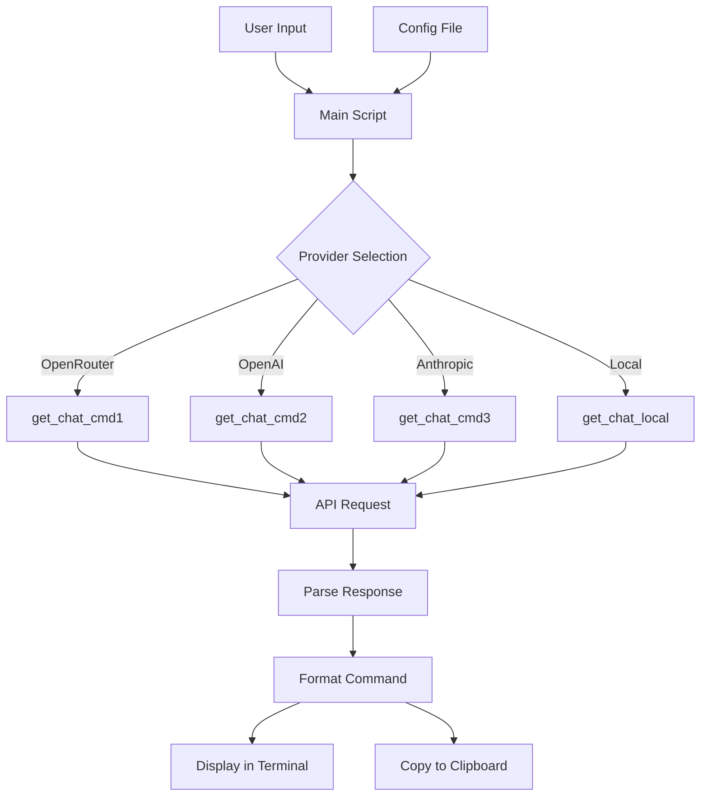

# Bash Implementation of get-chat-cmd (originally PowerShell project found [here](https://github.com/J-DubApps/get-chat-cmd))

## Project Overview

This is a bash implementation of my "[get-chat-cmd](https://github.com/J-DubApps/get-chat-cmd)" PowerShell project: allowing you to pose natural language (plain-English) requests and receive bash commands in return (via various AI providers). The implementation will maintain all the core features of my PowerShell project--but adapted for bash environments (tested so far on Ubuntu 24.04 LTS, and MacOS).

## Key Requirements

1. **Functionality**:
   - Support for my 4 favorite providers: OpenRouter, OpenAI, Anthropic, and locally-hosted models
   - Improved prompt engineering for more accurate bash commands
   - Display commands in terminal and automatically copy to clipboard (when available)

2. **Technical Approach**:
   - Minimal dependencies, I'm just using standard bash features and common utilities
   - Separate configuration file for API keys (for now, eventually I'd like to encrypt API keys)
   - Support for both curl and wget with automatic detection
   - JSON parsing with jq (preferred) or Python as fallback
   - Optional clipboard functionality with clear instructions
   - Minimal but informative error messages
   - Simple script that can be downloaded and sourced in .bashrc/.zshrc

## Design & Flow



## Implementation

### 1. Core Script Structure

1. **Main Script (`ai_bash_commands.sh`)**:
   - Contains all functions and core logic
   - Detects available utilities (curl/wget, jq/Python, clipboard tools)
   - Sources configuration file if available
   - Provides helper functions for API requests, JSON parsing, and clipboard operations

2. **Configuration File (`ai_bash_config.sh`)**:
   - Stores API keys for different providers
   - Contains customizable settings (e.g., default provider, output formatting)

### 2. Core Functions

1. **Provider-specific Functions**:
   - `get_chat_cmd1`: Uses OpenRouter's API
   - `get_chat_cmd2`: Uses OpenAI's API
   - `get_chat_cmd3`: Uses Anthropic's API
   - `get_chat_local`: Connects to locally-hosted models

2. **Utility Functions**:
   - `make_api_request`: Handles API communication using curl or wget
   - `parse_json_response`: Extracts command from API response using jq or Python
   - `copy_to_clipboard`: Copies command to clipboard if possible
   - `check_dependencies`: Verifies required tools are available
   - `display_command`: Formats and displays the command in the terminal

### 3. Improved Prompt Engineering

Enhanced prompts sent to AI models to improve the accuracy of generated bash commands:

1. **Context Enhancement**:
   - Include information about the user's environment (OS, shell version)
   - Specify that responses should be valid bash commands

2. **Command Formatting**:
   - Request commands without explanatory text
   - Ask for commands that work across standard bash environments
   - Specify preference for portable commands when possible

### 4. Error Handling and Feedback

1. **Error Detection**:
   - Check for missing dependencies
   - Validate API keys
   - Handle API request failures
   - Detect malformed responses

2. **User Feedback**:
   - Provide clear, minimal error messages
   - Offer suggestions for common issues (e.g., missing API keys)

### 5. Installation and Setup

1. **Installation Instructions**:
   - Download the script
   - Add source line to .bashrc/.zshrc
   - Create and configure the config file (see Readme.md for more info)

2. **Dependency Handling**:
   - Detect missing dependencies
   - Provide installation instructions for common platforms (apt, yum, homebrew)

## ToDo

Enhance error handling and feedback  
Test across different environments (Linux, macOS, WSL)

## File Structure

```
get-chat-cmd-bash/
├── ai_bash_commands.sh       # Main script with all functions
├── ai_bash_config.sh.example # Example configuration file
├── README.md                 # Documentation
└── LICENSE                   # MIT License
